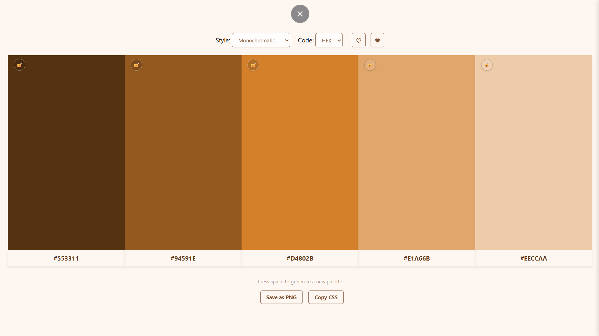

# Color Palette Generator

A simple web app where you can generate and manage color palettes, made with HTML, CSS and JavaScript

## Features / How to use

### Top bar
Here, you'll find a few buttons
- Style: You can pick between random, analogous, monochromatic and complementary to change the relation bettween the colors of the palette
- Code: you can choose the code format (HEX, RGB, HSL)
- ♡: Click here to save the current palette to favourites 
- ❤: click here to open the favourite list sidebar

### The palette itself
- By pressing "Space" or "Enter" you can generate a new palette
- The lock icon on a color allows you to keep it when generating new palettes
- Click a color swatch or its code to copy it in the selected format

### Bottom bar
- Use the "Save as PNG" button to export the palette as an image

- "Copy CSS" button to copy all colors as CSS variables.
> example:
 
:root {
 
    --color-1: #5A250C; 
 
    --color-2: #9D4015; 
 
    --color-3: #E05C1F; 
 
    --color-4: #EA8D62; 
 
    --color-5: #F3BEA5; 
}

### Sidebar

In the favourite list sidebar, you can Load a saved palette if you want to open it (replacing the current one) or Delete it if you don't like that palette anymore, there's not much more abt it